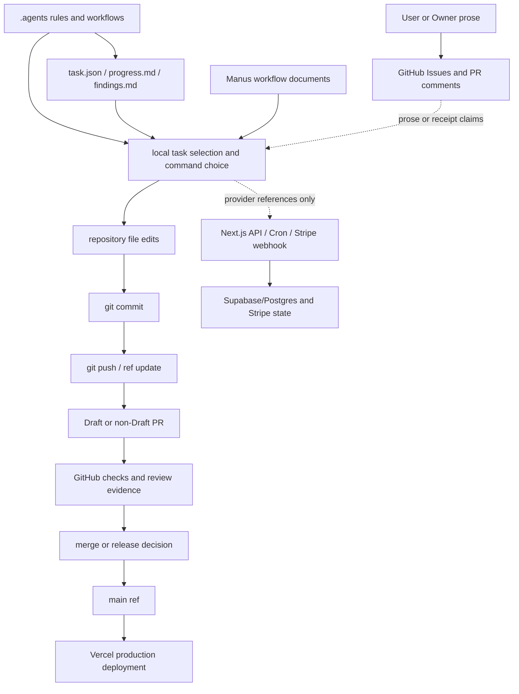

# G1A Legacy Authority Dependency Graph

```yaml
phase: G1A
material_type: NON_EXECUTABLE_DESIGN_AND_TEST_MATERIAL
live_enforcement_active: false
legacy_authority_disabled: false
replacement_policy_activated: false
g2_policy_binding_accepted: false
repository_id: 1133708061
task_issue: 282
task_state_version: 3
staging_exact_sha: 69beaf0b82717b0809f6a6f72c29fca0abe0b8d0
```

This graph is a descriptive model. It does not execute a freeze, revoke an authority, disable a workflow, archive a file, or change a writer.

## Current dependency graph



The graph shows possible dependency claims, not proof that every edge is currently active. In particular, `issues`, `PR`, `checks`, `main`, `Vercel`, `Supabase`, `Stripe`, and database state require live evidence at the point of mutation.

## Stage-by-stage writer model

| stage | possible source/consumer | state writer or mutation | current live authority | proposed post-G2 disposition |
|---|---|---|---|---|
| task selection | `.agents/**`, `task.json`, issue prose | local agent chooses a task | legacy/local claims; exact enforcement `NOT_OBSERVABLE` | only RMG-bound task identity |
| state write | `task.json`, `progress.md`, `findings.md` | local filesystem writer | legacy tracker material | derived evidence, never authorization |
| implementation | agent context, code/test paths | filesystem writer | owner/agent process and repo permissions | guard-before-mutation required |
| commit/push | `.agents/workflows/git-commit.md`, git | commit object and remote ref | git/GitHub permissions | exact base/head and receipt-bound writer |
| PR | `.github` templates, GitHub API | PR state, draft flag, base/head | GitHub API permissions | one primary PR, Draft, `staging` base |
| checks | `.github/workflows/**`, scripts | check-run/status | Actions and GitHub | evidence only until policy binding |
| merge | owner prose, PR state, repository settings | merge commit/ref | repository settings and owner gate | separate future receipt; not G1A |
| main/production | `main`, Vercel project | production ref/deployment | GitHub/Vercel | separate release gate; not G1A |
| external mutation | API/Cron/webhook, SQL/migration, provider clients | Supabase/Postgres/Stripe/Vercel state | source-level references only | provider-bound RMG writer |

## Authority separation

Current live authority and proposed disposition are intentionally not conflated:

- Current: `.agents`, tracker files, issue/PR prose, repository permissions, workflows, application routes, provider clients, and external systems are observable sources or possible writers. Their actual authority reachability is `UNVERIFIED` unless directly evidenced.
- Proposed after G2: a real policy binding and RMG become the only executable authority; legacy task files, Manus prose, tracker state, issue/PR prose, and chat become derived or historical material. This is `PROPOSED`, not active.
- G1A: no live freeze, neutralization, disable, archive, delete, policy activation, or writer replacement is performed.

## Exactly-one-writer and ordering contract

The future contract is `exactly-one-writer` with `dual_write_allowed=false`. Replacement activation and legacy executable disable must be one atomic G2 cutover, bound to the same policy digest, authority epoch, exact refs, CAS pre-state, and acceptance event. G1B may archive/delete legacy material only after an independently accepted `G2_POLICY_BINDING_ACCEPTED` event. The required order is:

```text
G1A design/test material
  -> independent exact-head audit
  -> separate G2 policy binding and atomic replacement/disable
  -> accepted G2 event
  -> G1B archive/delete legacy material
  -> later phases
```

No G1A artifact can act as a substitute for the G2 event.

## Threat paths and evidence ceiling

The following paths must be denied by the future RMG: a PR head supplying its own policy or PASS evidence; self-approval; admin/maintain/push bypass; a stale branch or stale `AGENTS.md`; tracker prose used as a receipt; duplicate or edited issue comments; direct provider or database writes that skip the guard; a second primary PR; a PR switched to Ready for review; and a merge/main/production action inferred from file existence. These are design threats, not claims that a live RMG currently blocks them.

The current evidence ceiling is repository text/blob, direct GitHub REST metadata, and exact ref comparison. It does not include provider-side policy, branch protection, Rulesets, deployment settings, runtime invocation, database state, or secret-backed identity. Unknown edges remain `NOT_OBSERVABLE`, `UNVERIFIED`, or `EVIDENCE_CEILING`.
