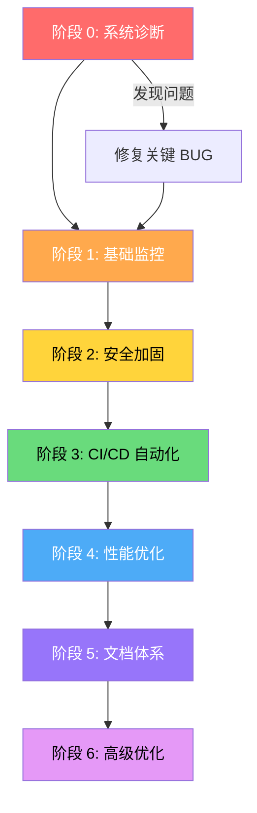

# GraylumAI 开发规范清单 - 终极版

> **版本**: 1.0.0
> **更新日期**: 2026-01-22
> **适用项目**: GraylumAI (AI 驱动的 SaaS 平台)

---

## 📖 使用说明

### 这份文档是什么？

这是一份**傻瓜式操作手册**，帮助你系统性地完善 GraylumAI 平台的监控、安全、测试和部署流程。

### 如何使用？

1. **按顺序执行** - 每个阶段都有依赖关系，请按顺序完成
2. **复制提示词** - 每个步骤的"复制给 Claude Code"部分可以直接使用
3. **验证后再继续** - 每个步骤完成后，按验证清单检查，全部通过再进入下一步
4. **遇到问题看失败处理** - 每个步骤都有失败后的处理建议

### 符号说明

| 符号 | 含义 |
|------|------|
| 🚨 | 必做 - 不做会有严重问题 |
| ⚠️ | 应该做 - 显著提升质量 |
| 💡 | 可选 - 锦上添花 |
| ⏱️ | 预计时间 |
| ✅ | 验证通过 |
| ❌ | 验证失败 |

---

## 🎯 核心原则

1. **先建监控，再修 BUG** - 没有监控就是盲修，可能修出新问题
2. **从内到外** - 先保证核心功能（AI、计费）正常，再完善外围
3. **小步快跑** - 每完成一个步骤就验证，不要积累问题
4. **留有记录** - 所有测试结果都保存，便于追踪问题
5. **成本意识** - 特别关注 AI API 成本，每次调用都是真金白银

---

## 📊 执行路线图



---

## 🚨 阶段 0: 系统诊断 (必须最先做 | 1天)

> **为什么最先做？** 这是你唯一能"看见"系统内部状态的方式。没有诊断工具，你永远不知道智能路由是否生效、Token 计算是否准确。

### ✅ 步骤 0.1: 创建系统诊断页面

**为什么要做：** 一键测试所有"看不见"的关键功能，把隐藏问题暴露出来

**复制给 Claude Code：**
```
任务: 创建管理后台"系统诊断"功能

## 第一部分 - 创建诊断服务

在 packages/api/src/services/ 下创建 diagnostics.ts:

### 测试函数列表 (共 11 项)

**AI 功能测试 (5项):**

1. testSmartRouting()
   目标: 验证智能路由是否正确分发
   步骤:
   - 发送简单问题 "1+1=?" → 应路由到 Haiku
   - 发送代码问题 "写一个 Python 排序函数" → 应路由到 Sonnet
   - 发送复杂分析 "分析这段代码的时间复杂度..." → 应路由到 Sonnet
   返回: { success, testCases: [{ input, expectedModel, actualModel, passed }] }

2. testTokenCalculation()
   目标: 验证 Token 计算精度
   步骤:
   - 使用 Haiku 发送测试消息 "Hello, how are you?"
   - 获取 API 返回的 usage.input_tokens 和 usage.output_tokens
   - 调用 tokenCounter.ts 的计算函数
   - 比对误差，允许 ±5%
   返回: { success, apiTokens, calculatedTokens, discrepancy, threshold: 0.05 }

3. testPromptCaching()
   目标: 验证 cache_control 标记是否正确添加
   步骤:
   - 检查 promptCacheBuilder.ts 的输出
   - 验证系统提示词有 cache_control: { type: 'ephemeral' }
   - 验证稳定消息区有缓存标记
   返回: { success, systemPromptCached, stableRegionCached, details }

4. testContextCompression()
   目标: 验证上下文压缩机制
   步骤:
   - 检查 contextManager.ts 配置
   - 验证阈值为 90000 (60%)
   - 验证稳定区域为 3 轮
   - 模拟长对话，验证摘要触发
   返回: { success, threshold, stableRegion, compressionTriggerWorks }

5. testStreamResponse()
   目标: 验证 SSE 流式响应
   步骤:
   - 调用 /api/ai/stream 端点
   - 验证返回 text/event-stream
   - 验证能收到 chunk 数据
   返回: { success, contentType, chunksReceived, latencyMs }

**计费功能测试 (3项):**

6. testBillingFlow()
   目标: 验证三段式计费完整性
   步骤:
   - 创建测试用户，设置 100 积分
   - 调用 preDeduct(50) → 冻结 50 积分
   - 调用 settle(30) → 实际扣除 30，退回 20
   - 验证最终余额 = 70
   返回: {
     success,
     initialCredits: 100,
     preDeducted: 50,
     settled: 30,
     finalCredits: 70,
     expectedFinal: 70,
     match: true
   }

7. testIdempotency()
   目标: 验证相同 requestId 不重复扣费
   步骤:
   - 使用相同 requestId 调用 preDeduct 两次
   - 验证只扣费一次
   返回: { success, requestId, callCount: 2, deductCount: 1 }

8. testBalanceReconciliation()
   目标: 对账 profiles.credits 与 billing_history
   步骤:
   - 查询用户当前 credits
   - 计算 billing_history 中所有交易的净值
   - 验证两者一致
   返回: { success, profileCredits, historySum, difference, tolerance: 0.01 }

**安全功能测试 (3项):**

9. testRateLimit()
   目标: 验证速率限制生效
   步骤:
   - 短时间内发送 65 次请求（限制 60/分钟）
   - 验证第 61 次被拒绝
   返回: { success, limit: 60, attempted: 65, rejected: 5 }

10. testCircuitBreaker()
    目标: 验证消费熔断生效
    步骤:
    - 检查熔断配置（10000/小时）
    - 模拟大量消费
    - 验证达到阈值后请求被阻止
    返回: { success, hourlyLimit, triggered: true/false }

11. testRLS()
    目标: 验证用户数据隔离
    步骤:
    - 创建用户 A 的对话
    - 用用户 B 的身份查询用户 A 的对话
    - 应该返回空或权限错误
    返回: { success, isolated: true, query: 'returned empty as expected' }

---

## 第二部分 - 创建 tRPC Router

在 packages/api/src/routers/ 创建 diagnostics.ts:

procedures:
1. diagnostics.runAll - 运行所有测试
2. diagnostics.runSingle - 运行单个测试
3. diagnostics.getHistory - 获取历史记录
4. diagnostics.getLatest - 获取最近一次结果

权限: 仅 admin 可访问

---

## 第三部分 - 创建数据库迁移

创建 packages/db/migrations/0005_diagnostics.sql:

CREATE TABLE diagnostic_reports (
  id uuid PRIMARY KEY DEFAULT gen_random_uuid(),
  status text NOT NULL CHECK (status IN ('success', 'partial', 'failed')),
  score integer NOT NULL, -- 0-100
  total_tests integer NOT NULL,
  passed_tests integer NOT NULL,
  failed_tests integer NOT NULL,
  results jsonb NOT NULL,
  duration_ms integer NOT NULL,
  triggered_by text NOT NULL, -- 'manual' | 'cron' | 'deploy'
  executed_by uuid REFERENCES profiles(id),
  created_at timestamptz DEFAULT now()
);

CREATE INDEX idx_diagnostic_reports_created ON diagnostic_reports(created_at DESC);

---

## 第四部分 - 创建前端页面

创建 apps/web/src/app/admin/diagnostics/page.tsx:

页面布局:
┌─────────────────────────────────────────────────────────┐
│  系统诊断                                    [一键测试]  │
├─────────────────────────────────────────────────────────┤
│  上次测试: 2026-01-22 16:45    状态: ✅ 全部通过 (11/11) │
│  健康得分: 100%                消耗积分: 3              │
├─────────────────────────────────────────────────────────┤
│                                                         │
│  ▼ AI 功能 (5/5 通过)                          ✅       │
│    ├─ 智能路由                                 ✅       │
│    │   └─ Haiku: ✅ | Sonnet: ✅ | 复杂分析: ✅         │
│    ├─ Token 计算精度                           ✅       │
│    │   └─ 误差: 2.3% (阈值 5%)                         │
│    ├─ Prompt Caching                           ✅       │
│    ├─ 上下文压缩                               ✅       │
│    └─ 流式响应                                 ✅       │
│                                                         │
│  ▼ 计费功能 (3/3 通过)                         ✅       │
│    ├─ 三段式计费流程                           ✅       │
│    ├─ 幂等性检查                               ✅       │
│    └─ 余额对账                                 ✅       │
│                                                         │
│  ▼ 安全功能 (3/3 通过)                         ✅       │
│    ├─ 速率限制                                 ✅       │
│    ├─ 消费熔断                                 ✅       │
│    └─ RLS 数据隔离                             ✅       │
│                                                         │
├─────────────────────────────────────────────────────────┤
│  历史记录                                    [查看全部]  │
│  ┌──────────────┬────────┬─────────┬───────────────┐   │
│  │ 时间         │ 状态   │ 得分    │ 触发方式      │   │
│  ├──────────────┼────────┼─────────┼───────────────┤   │
│  │ 16:00        │ ✅     │ 100%    │ 定时任务      │   │
│  │ 15:00        │ ⚠️     │ 91%     │ 手动          │   │
│  │ 14:00        │ ✅     │ 100%    │ 定时任务      │   │
│  └──────────────┴────────┴─────────┴───────────────┘   │
└─────────────────────────────────────────────────────────┘

交互要求:
- 点击测试分组可展开/折叠
- 失败的测试自动展开显示错误详情
- 每个失败项显示: 错误信息 + 文件位置 + 修复建议
- 一键测试按钮有加载状态和进度显示
- 测试完成后刷新历史记录

样式:
- 通过: 绿色边框 + bg-green-50
- 失败: 红色边框 + bg-red-50 + 自动展开
- 警告: 黄色边框 + bg-yellow-50
- 运行中: 蓝色边框 + animate-pulse

---

## 第五部分 - 配置定时任务

在 vercel.json 添加:
{
  "crons": [{
    "path": "/api/cron/diagnostics",
    "schedule": "0 * * * *"  // 每小时
  }]
}

创建 apps/web/src/app/api/cron/diagnostics/route.ts:
- 验证 Vercel Cron 签名
- 调用 diagnostics.runAll
- 如果有失败项，记录到日志

---

## 第六部分 - 测试账号

创建系统测试账号:
- email: system-test@graylum.internal
- role: user
- credits: 1000 (用于定时测试)
- 标记为系统账号，不参与正常业务统计

---

## 输出内容清单

1. packages/api/src/services/diagnostics.ts
2. packages/api/src/routers/diagnostics.ts
3. packages/db/migrations/0005_diagnostics.sql
4. apps/web/src/app/admin/diagnostics/page.tsx
5. apps/web/src/app/api/cron/diagnostics/route.ts
6. 更新 packages/api/src/root.ts (添加 router)
7. 更新 vercel.json (添加 cron)
8. 测试账号创建 SQL

请生成完整、可运行的代码。
```

**验证标准：**
- [ ] 访问 /admin/diagnostics 页面正常显示
- [ ] 点击"一键测试"，所有 11 项测试能执行
- [ ] 至少 9/11 测试通过（允许配置问题导致 1-2 项失败）
- [ ] 失败的测试显示详细错误信息和修复建议
- [ ] 历史记录能正常保存和显示

**预计时间：** ⏱️ 4-6 小时

**失败处理：**
- 如果页面 404 → 检查路由配置和权限中间件
- 如果测试超时 → 单独运行超时的测试，检查对应服务
- 如果全部失败 → 检查数据库连接和 API 密钥配置

**进入下一阶段条件：**
- ✅ 诊断页面能正常访问和运行
- ✅ 至少 80% 测试通过
- ✅ 已记录所有失败项的问题

---

## 🚨 阶段 1: 基础监控体系 (必做 | 2-3天)

> **为什么要做？** 诊断页面告诉你"当前状态"，监控系统告诉你"实时变化"。没有监控，你只能被动等用户投诉。

### ✅ 步骤 1.1: 安装错误监控 (Sentry)

**为什么要做：** 生产环境出错时，实时收到通知，而不是等用户投诉

**复制给 Claude Code：**
```
任务: 集成 Sentry 错误监控系统

要求:
1. 安装依赖:
   pnpm add @sentry/nextjs --filter web

2. 创建配置文件:
   - apps/web/sentry.client.config.ts (前端错误捕获)
   - apps/web/sentry.server.config.ts (后端错误捕获)
   - apps/web/sentry.edge.config.ts (Edge 函数错误捕获)

3. 配置内容:
   - DSN: 使用环境变量 NEXT_PUBLIC_SENTRY_DSN
   - 环境标识: development / staging / production
   - 采样率: 生产环境 100%，开发环境 0%
   - 忽略错误: 网络超时、用户取消请求、AbortError

4. 在 next.config.js 添加 Sentry 插件

5. 关键位置添加错误上下文:
   - AI API 调用: Sentry.setContext('ai_call', { model, inputTokens })
   - 积分扣费: Sentry.setContext('billing', { userId, amount })
   - 用户信息: Sentry.setUser({ id, email })

6. 创建测试端点: /api/sentry-test
   - GET 请求触发一个测试错误
   - 用于验证 Sentry 配置

7. 更新 .env.example 添加:
   NEXT_PUBLIC_SENTRY_DSN=your-sentry-dsn

输出:
- 所有配置文件代码
- next.config.js 修改
- 测试端点代码
- 验证步骤文档

参考: https://docs.sentry.io/platforms/javascript/guides/nextjs/
```

**验证标准：**
- [ ] 访问 /api/sentry-test 返回 500 错误
- [ ] 30 秒内 Sentry 后台能看到这个错误报告
- [ ] 错误报告包含用户 ID 和请求 URL

**预计时间：** ⏱️ 1 小时

**失败处理：**
- Sentry 收不到错误 → 检查 DSN 配置和网络连接
- 配置报错 → 检查 Next.js 版本兼容性

---

### ✅ 步骤 1.2: 建立结构化日志系统

**为什么要做：** 日志是排查问题的唯一依据，没有日志就是盲人摸象

**复制给 Claude Code：**
```
任务: 创建结构化日志系统

要求:
1. 安装 pino 日志库:
   pnpm add pino pino-pretty --filter api

2. 创建 packages/api/src/lib/logger.ts:
   - 开发环境: 美化输出 (pino-pretty)
   - 生产环境: JSON 格式
   - 日志级别: debug, info, warn, error
   - 自动添加: 时间戳、请求 ID、环境标识

3. 在关键业务点添加日志:

   a. 用户认证:
      logger.info('auth_success', { userId, method: 'password' })
      logger.warn('auth_failed', { email, reason: 'invalid_password' })

   b. 积分系统:
      logger.info('credits_deducted', {
        userId, amount, before, after, reason, requestId
      })
      logger.warn('credits_insufficient', { userId, required, available })

   c. AI 交互:
      logger.info('ai_call_start', { model, inputTokens, conversationId })
      logger.info('ai_call_complete', {
        model, inputTokens, outputTokens, durationMs, cost
      })
      logger.error('ai_call_failed', { model, error, retryCount })

   d. 计费流程:
      logger.info('billing_prededuct', { userId, amount, requestId })
      logger.info('billing_settle', { userId, prededucted, actual, refunded })
      logger.error('billing_failed', { userId, operation, error })

4. 创建数据库表存储关键日志:

   CREATE TABLE application_logs (
     id uuid PRIMARY KEY DEFAULT gen_random_uuid(),
     level text NOT NULL,
     category text NOT NULL,
     message text NOT NULL,
     context jsonb,
     user_id uuid,
     request_id text,
     created_at timestamptz DEFAULT now()
   );

   CREATE INDEX idx_logs_user ON application_logs(user_id);
   CREATE INDEX idx_logs_created ON application_logs(created_at DESC);
   CREATE INDEX idx_logs_category ON application_logs(category);

5. 添加日志清理任务:
   - 保留 30 天日志
   - 创建清理 SQL

输出:
- logger.ts 完整代码
- 数据库迁移文件
- 日志使用示例
```

**验证标准：**
- [ ] 发送 AI 消息后，日志包含 inputTokens、outputTokens、cost
- [ ] 登录失败时，日志记录失败原因
- [ ] application_logs 表有数据

**预计时间：** ⏱️ 2 小时

**失败处理：**
- 日志不显示 → 检查日志级别配置
- 数据库写入失败 → 检查表结构和权限

---

### ✅ 步骤 1.3: AI 成本追踪仪表板

**为什么要做：** Claude API 调用是你最大的成本支出，必须实时监控

**复制给 Claude Code：**
```
任务: 创建 AI 成本追踪仪表板

要求:
1. 创建页面 /admin/costs:

   布局:
   ┌─────────────────────────────────────────────┐
   │  AI 成本追踪                    [导出报告]  │
   ├─────────────────────────────────────────────┤
   │  今日消耗: $12.34    本月累计: $345.67      │
   │  今日调用: 1,234 次  平均成本: $0.01/次    │
   ├─────────────────────────────────────────────┤
   │  [日] [周] [月] 切换                        │
   │  ┌─────────────────────────────────────┐   │
   │  │         成本趋势图 (折线图)          │   │
   │  └─────────────────────────────────────┘   │
   ├─────────────────────────────────────────────┤
   │  模型分布 (饼图)                            │
   │  - Haiku: 60% ($7.40)                      │
   │  - Sonnet: 35% ($4.32)                     │
   │  - Opus: 5% ($0.62)                        │
   ├─────────────────────────────────────────────┤
   │  缓存效率                                   │
   │  - 缓存命中率: 45%                         │
   │  - 节省成本: $5.67 (32%)                   │
   ├─────────────────────────────────────────────┤
   │  高消耗用户 TOP 10                          │
   │  1. user@email.com - $23.45 - 234 次调用   │
   │  2. ...                                    │
   └─────────────────────────────────────────────┘

2. 数据来源:
   - 从 ai_usage_logs 和 token_stats 聚合
   - 实时计算成本 = tokens × 费率

3. 添加成本告警:
   - 单日成本 > $50 → 邮件告警
   - 单用户单日 > $10 → 标记异常

4. 费率配置:
   - 从 ai_models.token_rate 读取
   - 支持管理后台修改

输出:
- 成本仪表板完整代码
- 数据聚合查询
- 告警逻辑
```

**验证标准：**
- [ ] 成本仪表板显示今日消耗数据
- [ ] 模型分布饼图正确显示
- [ ] 高消耗用户列表有数据

**预计时间：** ⏱️ 3 小时

**失败处理：**
- 数据为空 → 检查 ai_usage_logs 表是否有数据
- 费率错误 → 检查 ai_models.token_rate 配置

---

**阶段 1 完成条件：**
- ✅ Sentry 能收到错误报告
- ✅ 日志系统正常工作
- ✅ 成本仪表板有数据显示
- ✅ 运行系统诊断，通过率 ≥ 90%

---

## ⚠️ 阶段 2: 安全加固 (应该做 | 1-2天)

> **为什么要做？** 安全漏洞一旦被利用，可能导致数据泄露或经济损失。

### ✅ 步骤 2.1: RLS 策略全面检查

**为什么要做：** 确保用户 A 无法访问用户 B 的数据

**复制给 Claude Code：**
```
任务: 审计和验证 Row Level Security 策略

要求:
1. 生成 RLS 审计报告:

   检查所有用户数据表:
   - profiles
   - conversations
   - messages
   - credit_transactions
   - tickets
   - ticket_replies
   - billing_history
   - ai_usage_logs
   - token_stats
   ...其他所有表

   对每个表输出:
   | 表名 | RLS 启用 | SELECT 策略 | INSERT 策略 | UPDATE 策略 | DELETE 策略 | 问题 |

2. 创建 RLS 测试脚本:

   测试场景:
   a. 创建用户 A，创建一条对话
   b. 用用户 B 的身份查询 → 应该返回空
   c. 用管理员身份查询 → 应该能看到
   d. 输出详细测试结果

3. 如果发现缺失策略，生成修复 SQL

输出:
- RLS 审计报告 (Markdown)
- 测试脚本
- 修复 SQL (如果需要)
```

**验证标准：**
- [ ] 审计报告显示所有表都启用 RLS
- [ ] 运行测试脚本，100% 通过
- [ ] 系统诊断的 testRLS 测试通过

**预计时间：** ⏱️ 2 小时

---

### ✅ 步骤 2.2: 环境变量安全检查

**为什么要做：** 防止 API 密钥泄露到代码仓库

**复制给 Claude Code：**
```
任务: 环境变量安全审计

要求:
1. 扫描代码查找硬编码密钥:
   - 搜索 "sk-ant-" (Anthropic API key)
   - 搜索 "pk_" 或 "sk_" (Stripe key)
   - 搜索 "supabase" 在 .ts/.tsx 文件中

2. 验证安全配置:
   - .env 是否在 .gitignore
   - .env.local 是否在 .gitignore
   - .env.example 是否只有占位符

3. 创建环境变量验证脚本:
   - 启动时检查必需变量
   - 验证格式正确性
   - 生产环境检查不能用测试密钥

输出:
- 安全审计报告
- 验证脚本
- .env.example 更新
```

**验证标准：**
- [ ] 代码中搜索 "sk-ant-" 返回 0 结果
- [ ] .env 不在 Git 仓库中
- [ ] 启动时验证脚本通过

**预计时间：** ⏱️ 1 小时

---

### ✅ 步骤 2.3: 依赖安全扫描

**为什么要做：** 第三方库可能有已知漏洞

**复制给 Claude Code：**
```
任务: 设置依赖安全扫描

要求:
1. 运行 pnpm audit 并分析结果

2. 配置 Dependabot:
   创建 .github/dependabot.yml:

   version: 2
   updates:
     - package-ecosystem: "npm"
       directory: "/"
       schedule:
         interval: "weekly"
       open-pull-requests-limit: 10

3. 创建安全检查 GitHub Action:
   - 每次 PR 运行 npm audit
   - 高危漏洞阻止合并

输出:
- 当前漏洞报告
- Dependabot 配置
- GitHub Action 配置
```

**验证标准：**
- [ ] pnpm audit 显示 0 个高危漏洞
- [ ] Dependabot 在 GitHub 启用
- [ ] PR 检查包含安全扫描

**预计时间：** ⏱️ 30 分钟

---

**阶段 2 完成条件：**
- ✅ RLS 审计报告无高危问题
- ✅ 无硬编码密钥
- ✅ 依赖无高危漏洞
- ✅ 系统诊断通过率 ≥ 95%

---

## ⚠️ 阶段 3: CI/CD 自动化 (应该做 | 1天)

> **为什么要做？** 自动化部署减少人为错误，确保每次发布都经过测试。

### ✅ 步骤 3.1: GitHub Actions 自动部署

**为什么要做：** 代码提交后自动测试和部署

**复制给 Claude Code：**
```
任务: 配置 GitHub Actions CI/CD

要求:
1. 创建 .github/workflows/ci.yml:

   触发条件:
   - push 到 main 或 develop
   - PR 到 main

   Jobs:

   lint-and-type:
     - 运行 ESLint
     - 运行 TypeScript 类型检查

   test:
     - 运行单元测试 (pnpm test)

   security:
     - 运行 pnpm audit

   build:
     - 运行 pnpm build
     - 验证构建成功

   deploy-preview:
     - 仅 PR: 部署预览环境
     - 输出预览 URL

   deploy-production:
     - 仅 main 分支
     - 需要前面所有 job 通过
     - 触发 Vercel 生产部署

2. 创建部署通知:
   - 部署成功/失败发送通知

输出:
- CI/CD 配置文件
- 部署文档
- Secrets 配置指南
```

**验证标准：**
- [ ] 推送代码，GitHub Actions 自动运行
- [ ] 所有检查通过后才能合并
- [ ] main 分支自动部署到生产

**预计时间：** ⏱️ 2 小时

---

### ✅ 步骤 3.2: 配置 Staging 环境

**为什么要做：** 先在测试环境验证，再上生产

**复制给 Claude Code：**
```
任务: 配置 Staging 环境

要求:
1. Vercel 环境配置:
   - Production: main 分支 → app.graylum.ai
   - Preview: develop 分支 → staging.graylum.ai

2. 环境区分逻辑:
   - 读取 VERCEL_ENV 判断环境
   - 不同环境使用不同配置

3. 部署检查清单文档:
   - 部署到 Staging 的步骤
   - 部署到 Production 的步骤
   - 回滚步骤

输出:
- 环境配置代码
- 部署检查清单
- 回滚脚本
```

**验证标准：**
- [ ] develop 分支部署到 staging 域名
- [ ] main 分支部署到生产域名
- [ ] 两个环境数据隔离

**预计时间：** ⏱️ 2 小时

---

**阶段 3 完成条件：**
- ✅ CI/CD 流水线正常运行
- ✅ Staging 和 Production 环境分离
- ✅ 部署检查清单文档完成

---

## ⚠️ 阶段 4: 性能优化 (应该做 | 1天)

> **为什么要做？** 性能差会导致用户流失，AI 响应慢会让用户以为系统坏了。

### ✅ 步骤 4.1: 启用 Vercel Analytics

**为什么要做：** 了解真实用户的访问情况和性能数据

**复制给 Claude Code：**
```
任务: 集成 Vercel Analytics 和 Speed Insights

要求:
1. 安装依赖:
   pnpm add @vercel/analytics @vercel/speed-insights --filter web

2. 在 layout.tsx 添加:
   import { Analytics } from '@vercel/analytics/react';
   import { SpeedInsights } from '@vercel/speed-insights/next';

3. 配置 Web Vitals 阈值:
   - LCP < 2.5s
   - FID < 100ms
   - CLS < 0.1

输出:
- 集成代码
- 配置说明
```

**验证标准：**
- [ ] Vercel Dashboard 显示访问数据
- [ ] Web Vitals 指标有数据

**预计时间：** ⏱️ 30 分钟

---

### ✅ 步骤 4.2: 数据库性能优化

**为什么要做：** 数据库是最常见的性能瓶颈

**复制给 Claude Code：**
```
任务: 数据库性能优化

要求:
1. 分析慢查询:
   - 在 Supabase Dashboard 查看 Query Performance
   - 识别 > 500ms 的查询

2. 添加必要索引:
   - conversations(user_id, created_at DESC)
   - messages(conversation_id, created_at DESC)
   - billing_history(user_id, created_at DESC)
   - 其他高频查询字段

3. 实现查询缓存:
   - 用户积分查询缓存 1 分钟
   - AI 模型配置缓存 5 分钟

输出:
- 索引优化 SQL
- 缓存实现代码
- 优化报告
```

**验证标准：**
- [ ] 常用查询 < 200ms
- [ ] 缓存命中率 > 50%

**预计时间：** ⏱️ 2 小时

---

**阶段 4 完成条件：**
- ✅ Vercel Analytics 有数据
- ✅ 主要页面 LCP < 2.5s
- ✅ 数据库查询 < 500ms

---

## ⚠️ 阶段 5: 文档体系 (应该做 | 1天)

> **为什么要做？** 没有文档，3 个月后你自己都看不懂代码。

### ✅ 步骤 5.1: 创建技术文档

**为什么要做：** 方便自己和未来团队成员了解系统

**复制给 Claude Code：**
```
任务: 创建技术文档体系

要求:
1. 创建 /docs 目录结构:

   /docs
   ├── README.md (文档索引)
   ├── ARCHITECTURE.md (系统架构)
   ├── API_REFERENCE.md (API 文档)
   ├── DATABASE_SCHEMA.md (数据库设计)
   ├── DEPLOYMENT.md (部署指南)
   └── TROUBLESHOOTING.md (故障排查)

2. 生成架构图 (Mermaid):
   - 系统整体架构
   - 数据流程图
   - 关键模块关系

3. 从代码自动提取 API 文档:
   - tRPC procedures 列表
   - 输入输出类型
   - 使用示例

输出:
- 所有文档内容
- 架构图代码
```

**验证标准：**
- [ ] /docs 目录包含所有文档
- [ ] 架构图在 GitHub 正确渲染
- [ ] 新人能通过文档理解系统

**预计时间：** ⏱️ 4 小时

---

### ✅ 步骤 5.2: 创建操作手册

**为什么要做：** 紧急情况下快速响应

**复制给 Claude Code：**
```
任务: 创建运维操作手册 (Runbooks)

要求:
创建以下 runbooks:

1. /docs/runbooks/deploy-production.md
   - 部署前检查清单
   - 部署步骤
   - 验证步骤
   - 回滚计划

2. /docs/runbooks/rollback.md
   - 何时回滚
   - 回滚命令
   - 验证回滚成功

3. /docs/runbooks/handle-api-limits.md
   - Claude API 429 错误处理
   - 切换模型策略
   - 联系 Anthropic

4. /docs/runbooks/security-incident.md
   - 发现漏洞的处理流程
   - 通知用户流程
   - 事件报告模板

输出:
- 4 个完整 runbook
- 快速参考清单
```

**验证标准：**
- [ ] 每个 runbook 有清晰步骤
- [ ] 包含可复制的命令
- [ ] 紧急情况能 5 分钟内找到对应手册

**预计时间：** ⏱️ 2 小时

---

**阶段 5 完成条件：**
- ✅ 文档目录结构完整
- ✅ 架构图清晰易懂
- ✅ Runbooks 覆盖主要场景

---

## 💡 阶段 6: 高级优化 (可选 | 按需)

> **什么时候做？** 前 5 个阶段全部完成，且系统稳定运行 1 周以上。

### ✅ 步骤 6.1: 优化 AI 流式输出

**为什么要做：** 提升用户体验，AI 响应逐字显示

**复制给 Claude Code：**
```
任务: 优化 AI 流式响应体验

要求:
1. 验证当前流式实现:
   - 检查 streamHandler.ts
   - 验证 SSE 连接正常

2. 优化前端显示:
   - 添加打字机效果
   - "AI 正在思考..." 提示
   - 中断后保存已生成内容

3. 错误处理:
   - 流中断自动重连
   - 不重复扣费机制

输出:
- 优化后的流式代码
- 前端组件代码
```

**验证标准：**
- [ ] AI 响应逐字显示
- [ ] 中断后已显示内容保留
- [ ] 系统诊断的 testStreamResponse 通过

**预计时间：** ⏱️ 4 小时

---

### ✅ 步骤 6.2: 优化 Prompt Caching

**为什么要做：** 降低 30-50% 的 AI API 成本

**复制给 Claude Code：**
```
任务: 优化 Prompt Caching 效率

要求:
1. 验证当前缓存实现:
   - 检查 promptCacheBuilder.ts
   - 验证 cache_control 标记正确

2. 优化缓存策略:
   - 系统提示词 100% 缓存
   - 稳定消息区缓存
   - 记录缓存命中率

3. 添加缓存效率监控:
   - 在成本仪表板显示
   - cache_creation_input_tokens
   - cache_read_input_tokens
   - 节省百分比

输出:
- 优化后的缓存代码
- 监控代码
```

**验证标准：**
- [ ] 缓存命中率 > 50%
- [ ] 成本仪表板显示节省百分比
- [ ] 系统诊断的 testPromptCaching 通过

**预计时间：** ⏱️ 3 小时

---

## 📋 快速参考

### 优先级矩阵

| 阶段 | 紧急程度 | 重要程度 | 建议时间 | 是否必做 |
|------|---------|---------|---------|---------|
| 阶段 0: 系统诊断 | 🔴 高 | 🔴 高 | 1 天 | 必做 |
| 阶段 1: 基础监控 | 🔴 高 | 🔴 高 | 2-3 天 | 必做 |
| 阶段 2: 安全加固 | 🟡 中 | 🔴 高 | 1-2 天 | 必做 |
| 阶段 3: CI/CD | 🟡 中 | 🟡 中 | 1 天 | 应该做 |
| 阶段 4: 性能优化 | 🟢 低 | 🟡 中 | 1 天 | 应该做 |
| 阶段 5: 文档体系 | 🟢 低 | 🟡 中 | 1 天 | 应该做 |
| 阶段 6: 高级优化 | 🟢 低 | 🟢 低 | 按需 | 可选 |

### 周规划建议

**Week 1: 建立基础**
- Day 1-2: 阶段 0 (系统诊断)
- Day 3-5: 阶段 1 (基础监控)

**Week 2: 加固安全**
- Day 1-2: 阶段 2 (安全加固)
- Day 3: 阶段 3 (CI/CD)
- Day 4-5: 修复诊断发现的问题

**Week 3: 完善体验**
- Day 1: 阶段 4 (性能优化)
- Day 2-3: 阶段 5 (文档体系)
- Day 4-5: 稳定性测试

**Week 4+: 持续优化**
- 阶段 6 (高级优化)
- 根据监控数据持续改进

### 关键决策点

| 问题 | 建议 |
|------|------|
| 何时开始修复 BUG？ | 完成阶段 0 后，根据诊断结果决定 |
| 何时部署到生产？ | 系统诊断通过率 ≥ 95% 且无高危问题 |
| 何时投入高级优化？ | 阶段 1-5 完成，系统稳定运行 1 周 |
| 发现严重 BUG 怎么办？ | 暂停当前任务，优先修复，记录到诊断系统 |

---

## 🛠️ 工具和资源清单

### 必需服务

| 服务 | 用途 | 注册链接 |
|------|------|---------|
| Sentry | 错误监控 | https://sentry.io |
| Vercel | 部署托管 | https://vercel.com |
| Supabase | 数据库 | https://supabase.com |
| GitHub | 代码仓库 | https://github.com |

### 推荐工具

| 工具 | 用途 | 说明 |
|------|------|------|
| Dependabot | 依赖安全 | GitHub 内置 |
| Vercel Analytics | 性能监控 | Vercel 内置 |
| pino | 日志库 | Node.js |

---

## ❓ 常见问题

### Q: 我应该先修 BUG 还是先建监控？

**A:** 先建监控！原因：
1. 没有监控，你不知道哪些 BUG 最严重
2. 修完 BUG 可能引入新 BUG，没监控发现不了
3. 系统诊断会告诉你哪些问题最紧急

### Q: 系统诊断发现很多问题怎么办？

**A:** 按优先级处理：
1. 🔴 计费相关问题 → 立即修复（涉及钱）
2. 🔴 安全相关问题 → 立即修复（数据泄露）
3. 🟡 AI 功能问题 → 计划修复
4. 🟢 其他问题 → 记录，后续处理

### Q: 每个步骤的时间估算准确吗？

**A:** 时间估算基于：
- 熟练开发者的执行时间
- 不包括学习和调试时间
- 实际可能需要 1.5-2 倍时间
- 遇到问题随时可以问 Claude

### Q: 我是非技术背景，能自己完成吗？

**A:** 可以！每个步骤的提示词都可以直接复制给 Claude Code，它会帮你生成代码。你只需要：
1. 按顺序执行
2. 验证每个步骤
3. 遇到问题描述给 Claude

---

## 📝 附录

### 附录 A: 完整提示词索引

| 步骤 | 提示词标题 | 预计时间 |
|------|-----------|---------|
| 0.1 | 创建系统诊断页面 | 4-6h |
| 1.1 | 集成 Sentry 错误监控 | 1h |
| 1.2 | 创建结构化日志系统 | 2h |
| 1.3 | AI 成本追踪仪表板 | 3h |
| 2.1 | RLS 策略审计 | 2h |
| 2.2 | 环境变量安全检查 | 1h |
| 2.3 | 依赖安全扫描 | 30m |
| 3.1 | GitHub Actions CI/CD | 2h |
| 3.2 | 配置 Staging 环境 | 2h |
| 4.1 | Vercel Analytics | 30m |
| 4.2 | 数据库性能优化 | 2h |
| 5.1 | 创建技术文档 | 4h |
| 5.2 | 创建操作手册 | 2h |
| 6.1 | 优化 AI 流式输出 | 4h |
| 6.2 | 优化 Prompt Caching | 3h |

### 附录 B: 验证清单汇总

**阶段 0 验证:**
- [ ] 诊断页面正常访问
- [ ] 11 项测试能执行
- [ ] 通过率 ≥ 80%

**阶段 1 验证:**
- [ ] Sentry 收到错误
- [ ] 日志正常记录
- [ ] 成本仪表板有数据

**阶段 2 验证:**
- [ ] RLS 100% 覆盖
- [ ] 无硬编码密钥
- [ ] 无高危依赖漏洞

**阶段 3 验证:**
- [ ] CI/CD 自动运行
- [ ] Staging/Production 分离

**阶段 4 验证:**
- [ ] Analytics 有数据
- [ ] 查询 < 500ms

**阶段 5 验证:**
- [ ] 文档完整
- [ ] Runbooks 可用

### 附录 C: 故障排查快速指南

| 问题 | 快速排查 |
|------|---------|
| 页面 404 | 检查路由配置、权限中间件 |
| API 500 | 查看 Sentry、检查日志 |
| 数据库连接失败 | 检查 DATABASE_URL、网络 |
| AI 调用失败 | 检查 API Key、查看限额 |
| 积分不扣除 | 运行系统诊断、检查日志 |
| 部署失败 | 查看 Vercel 日志、检查构建 |

---

**文档结束**

> 💡 **提示**: 这份文档会随着项目发展持续更新。建议每月回顾一次，确保内容与实际情况一致。
